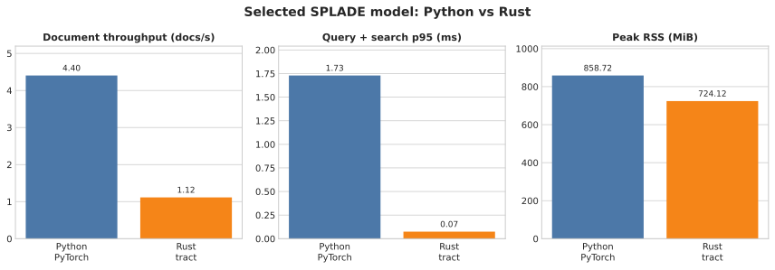

# Rust 이식 결과

## 구성

- 문서: BERT MLM + SPLADE pooling + top-256을 ONNX에 포함
- 질의: tokenizer와 30,522개 정적 가중치를 Rust에서 직접 계산, top-32
- 검색: `u16` term ID와 `f32` weight의 역색인
- 런타임: tract-onnx 0.23.4, tokenizers 0.23.1

Rust는 30,522차원 dense 배열을 인덱스에 저장하지 않는다. 문서당 최대 256개, 질의당 최대 32개 `(term_id, weight)`만 보관한다.

## 검증

| 검증 | 결과 |
|---|---:|
| fixture 문서/질의 벡터 | term ID 일치, weight 오차 ≤ 1e-4 |
| 실제 corpus | 267문서 |
| 실제 qrel 질의 | 60개 |
| Python top-10 순위 | 60/60 완전 일치 |
| 최대 검색 점수 오차 | 0.00003288 |

## 비용

| 항목 | 실측 |
|---|---:|
| 모델 로드(해시 검증 포함) | 2.19초 |
| 문서 인코딩 | 239.45초 / 267문서 |
| 문서 처리량 | 1.115 docs/s |
| 질의+검색 p50 / p95 | 0.033 / 0.075ms |
| 최대 RSS | 724.1MiB |
| 런타임 파일 | 132.39MiB |
| 실제 직렬화 인덱스 환산 | 20.30MiB / 1만 문서 |

release 프로필에서 측정했다. 질의 경로 비용은 작다. 문서 모델은 시작 시 한 번 로드하고, 문서 추가·변경 때만 백그라운드 인덱싱한다. 현재 tract 처리량으로 요청 중 동기 인코딩은 하지 않는다.

